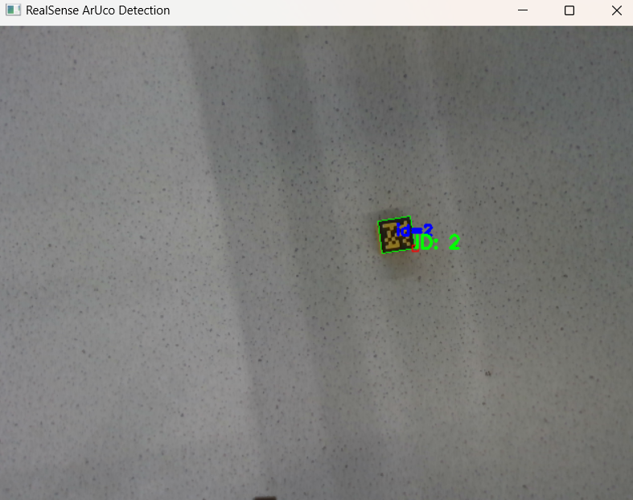

# visuomotorgrasp - Project in Progress
Vision based manipulation - Experimental Repo

# Install pyrealsense2
To access 

```bash
pip install pyrealsense2
```

# Start ubuntu terminal
```bash
wsl.exe -d Ubuntu
```

Move to the project folder and create a virtual environment
# Activate virtual env for wsl
```bash
source cam-env/bin/activate
```

# Deactivate environment
```bash
deactivate
```

# Realsense Camera Detetion using Aruco Markers 




# Nvidia Isaac Sim Commands
Run  the following commands
```bash
cd ~/isaacsim
./post_install.sh
./isaac-sim.selector.sh
```
